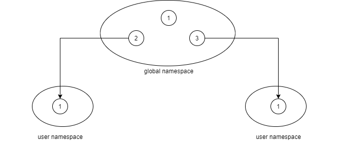
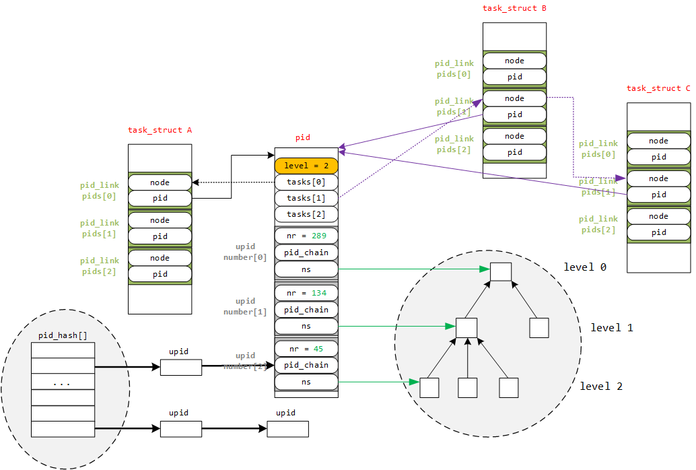

# 1.3 命名空间

如您所知，Linux是一个多用户操作系统，那么自然就要使不同用户相互隔离，比方说，禁止用户A去写用户B的文件。每个用户必须看起来像是独占了整个计算机，这和我们现今接触的“虚拟机”概念似乎相近，但Linux提供了一种更加高效的方案：“命名空间”

如下内容将以**pid namespace**为例进行说明，但Linux提供的命名空间作有着不仅如此的服务，比如IPC namespace、mount namespace、user namespace等共计7种。

### 1.3.1 命名空间的概念和实现思路

我们知道，一个操作系统在启动之初会构建一系列必要的进程，其中， init 进程的pid为1。但现在我们希望每个用户之间相互隔离，那么假如现在一台计算机上有两个用户登录，那么就应该为每个用户分别维护一个init进程，这样一来就违反了pid唯一的原则了。

于是内核提供命名空间这一概念。“每个进程有唯一的pid”这一说法的准确描述为“每个进程在任意一个命名空间中具有唯一的pid。”

所以事实如您所见，pid不只有一个，它们的关系大致如下：



全局命名空间中的2号和3号任务分别映射到用户命名空间中，成为用户命名空间中的init进程。

进程2的pid struct中的upid struct很好的描述了这个现状：

> numbers\[0].nr=2 numbers\[1].nr=1

但需要注意，父命名空间能够感知到子命名空间，但这必须是单向的。意味着对于子命名空间来说，它们必须以为自己独占了计算机，init进程的pid为1。

一个不够完善但很好理解的实现思路是chroot系统调用。全局命名空间使用根目录，为用户命名空间则是其子目录。子目录无法向上访问根目录，但根目录却能够感知子目录的存在(禁止了“../”后就没办法返回上级目录了)。 当然，我们实际用来创建命名空间的是unshare系统调用。

pid\_namespace的实际定义如下：（有删减）

```c
struct pid_namespace {
	struct idr idr;
	unsigned int pid_allocated;
	struct task_struct *child_reaper;
	unsigned int level;
	struct pid_namespace *parent;
	struct user_namespace *user_ns;
	struct ucounts *ucounts;
} __randomize_layout;
```

我们现在其实并不关心这些成员的用处，关于pid的分配，笔者将在1.5小节进行详细的分析，但适当的说明还是有益于行文的通顺。

* child\_reaper：该命名空间中的init进程
* level：命名空间的深度
* parent：父命名空间
* user\_ns：指向该pid namespace所属的user namespace
* ucounts：使用该pid namespace的用户数量

您也可以参考下图：(它来自参考资料-4)

在level 2命名空间中创建一个任务，分配其pid为45，那么在level 1中就会创建对应的映射，其pid为134，level 0同理拥有pid 289(但pid\_hash在5.16版本中并不存在，该结构作用于4.x版本下)。



### 1.3.2 其他

在task\_struct中有一个专门的成员用以描述命名空间：

```c
struct nsproxy {
	atomic_t count;
	struct uts_namespace *uts_ns;
	struct ipc_namespace *ipc_ns;
	struct mnt_namespace *mnt_ns;
	struct pid_namespace *pid_ns_for_children;
	struct net 	     *net_ns;
	struct time_namespace *time_ns;
	struct time_namespace *time_ns_for_children;
	struct cgroup_namespace *cgroup_ns;
};
extern struct nsproxy init_nsproxy;
```

它记录了整个任务的所有命名空间资源，pid namespace也囊括其中。

### 1.3.3 参考资料

* Linux系统如何标识进程？： http://www.wowotech.net/process\_management/pid.html
* Linux namespace之：pid namespace https://www.junmajinlong.com/virtual/namespace/pid\_namespace/
* Pid Namespace 原理与源码分析 https://zhuanlan.zhihu.com/p/335171876
* linux内核PID管理 https://carecraft.github.io/basictheory/2017/03/linux-pid-manage/
