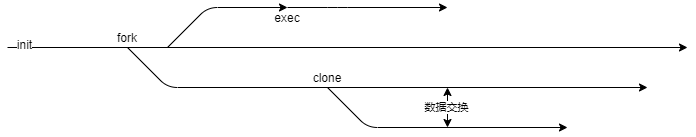

# Chaos me | Linux kernel architecture
Chapter 1>进程process

---

## 1.3 进程类型
 一般来讲，进程的产生主要依赖于 **fork/exec** 两个系统调用产生。前者会生成当前进程的副本，而后者则从二进制文件加载新程序。

 另外包括clone在内，这些系统调用最终都会使用kernel_clone内核函数进行实际的进程创造工作，这一点笔者打算在1.5小节详细介绍，本节仅概述这些调用的不同之处。

### 1.3.1 关系与不同

 其实为此特地划分一小节出来并无多大意义，但笔者出于本书的层次结构考虑，还是这样做了，我希望这样能让您在阅读的时候更容易理解我想要向您表达什么内容。

 
 
 笔者倾向于用这样的结构来描述整个进程关系。
 - 在某一时刻，init进程调用fork创建一个分支，即子任务，这个任务是init进程的副本（二者的task_struct高度相似，但具体有多相似，在1.5小节描述），我们称他为task 1。
 - 而init有某一时刻fork出一个新分支，但该分支很快调用了exec覆盖了原分支，通过exec创建的任务会直接使用原任务的task_struct，不再需要做复杂的复制工作。
 - 而task1在某一时刻调用clone来创建一个新分支task 2。在clone阶段通过传入一些特定参数，task 1和task 2允许一定程度的数据共享。

 另外，在未来的某一时刻，task 2需要终止，用户对其发出SIGKILL信号后，task 1需要调用wait4系统调用准备回收task 2的所有资源（如果没有回收，就会出现zombie process，最终不得不由内核来回收这部分资源）。
