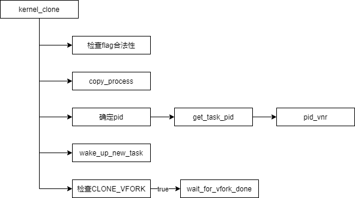

# Chaos me | Linux kernel architecture
Chapter 1>进程process

---

## 1.5 进程创造
 本节笔者打算按照递进的叙事结构进行介绍，希望这样的描述能让让我想要说清楚的东西变得容易理解一些。

### 1.5.1 相关调用
#### 1.5.1.1 fork
 fork定义如下：

```c
//pid_t fork(void)
SYSCALL_DEFINE0(fork)
{
#ifdef CONFIG_MMU
	struct kernel_clone_args args = {
		.exit_signal = SIGCHLD,
	};
	return kernel_clone(&args);
#else
	/* can not support in nommu mode */
	return -EINVAL;
#endif
}
```

 类似的，vfork定义如下：
```c
//pid_t vfork(void)
SYSCALL_DEFINE0(vfork)
{
	struct kernel_clone_args args = {
		.flags		= CLONE_VFORK | CLONE_VM,
		.exit_signal	= SIGCHLD,
	};
	return kernel_clone(&args);
}
```

#### 1.5.1.2 clone
```c
SYSCALL_DEFINE5(clone, unsigned long, clone_flags, unsigned long, newsp,
                 int __user *, parent_tidptr,
                 unsigned long, tls, 
                 int __user *, child_tidptr)
{
        struct kernel_clone_args args = {
                .flags          = (lower_32_bits(clone_flags) & ~CSIGNAL),
                .pidfd          = parent_tidptr,
                .child_tid      = child_tidptr,
                .parent_tid     = parent_tidptr,
                .exit_signal    = (lower_32_bits(clone_flags) & CSIGNAL),
                .stack          = newsp,
                .tls            = tls, 
        };   
        return kernel_clone(&args);
}                 
```

#### 1.5.1.3 kernel_thread
```c
pid_t kernel_thread(int (*fn)(void *), void *arg, unsigned long flags)
{
        struct kernel_clone_args args = {
                .flags          = ((lower_32_bits(flags) | CLONE_VM |
                                    CLONE_UNTRACED) & ~CSIGNAL),
                .exit_signal    = (lower_32_bits(flags) & CSIGNAL),
                .stack          = (unsigned long)fn,
                .stack_size     = (unsigned long)arg,
        };
        return kernel_clone(&args);
}
```

 如您所见，这些调用全都是相同的模板：
 - 初始化参数
 - kernel_clone(&args)

 但execve有些不一样：
 
```c
static int do_execve(struct filename *filename,
	const char __user *const __user *__argv,
	const char __user *const __user *__envp)
{
	struct user_arg_ptr argv = { .ptr.native = __argv };
	struct user_arg_ptr envp = { .ptr.native = __envp };
	return do_execveat_common(AT_FDCWD, filename, argv, envp, 0);
}
```
 execve意味着覆盖当前任务，因此它不需要像其他任务那样使用kernel_clone来创建一份任务拷贝，只需要在当前任务上直接将代码和数据段覆盖即可。本节笔者不打算详细讨论它，我们的重点在于如何创建任务。

 那么接下来看看kernel_clone的具体过程吧。

### 1.5.2 kernel_clone
 kernel_clone定义：
 
```c
pid_t kernel_clone(struct kernel_clone_args *args)
{
	u64 clone_flags = args->flags;
	struct completion vfork;
	struct pid *pid;
	struct task_struct *p;
	int trace = 0;
	pid_t nr;

	if ((args->flags & CLONE_PIDFD) &&
	    (args->flags & CLONE_PARENT_SETTID) &&
	    (args->pidfd == args->parent_tid))
		return -EINVAL;

	if (!(clone_flags & CLONE_UNTRACED)) {
		if (clone_flags & CLONE_VFORK)
			trace = PTRACE_EVENT_VFORK;
		else if (args->exit_signal != SIGCHLD)
			trace = PTRACE_EVENT_CLONE;
		else
			trace = PTRACE_EVENT_FORK;

		if (likely(!ptrace_event_enabled(current, trace)))
			trace = 0;
	}

	p = copy_process(NULL, trace, NUMA_NO_NODE, args);
	add_latent_entropy();

	if (IS_ERR(p))
		return PTR_ERR(p);

	trace_sched_process_fork(current, p);

	pid = get_task_pid(p, PIDTYPE_PID);
	nr = pid_vnr(pid);

	if (clone_flags & CLONE_PARENT_SETTID)
		put_user(nr, args->parent_tid);

	if (clone_flags & CLONE_VFORK) {
		p->vfork_done = &vfork;
		init_completion(&vfork);
		get_task_struct(p);
	}

	wake_up_new_task(p);

	if (unlikely(trace))
		ptrace_event_pid(trace, pid);

	if (clone_flags & CLONE_VFORK) {
		if (!wait_for_vfork_done(p, &vfork))
			ptrace_event_pid(PTRACE_EVENT_VFORK_DONE, pid);
	}

	put_pid(pid);
	return nr;
}
```

 直接贴出代码的目的是为了摆出依据，让您能够随时对比我的总结和省略。我相信一般来讲，除非实在无可奈何，我们都不愿意直接阅读源代码，因此笔者的总结如下：



- 检查flag合法性：有些flag之间是相互矛盾的，CLONE_PIDFD要求将子进程PID文件描述符放在父进程的内存空间中指定的位置，而CLONE_PARENT_SETTID则直接要求将子进程pid储存在父进程的某个既定位置处。
- copy_process：大部分的复制工作都在该函数中处理，笔者将在1.5.3小节再作讨论。
- wake_up_new_task：将子任务添加到调度队列。但调度器能够对新启动的任务进行特殊处理以让它尽快开始运行。倘若子进程在父进程之前开始运行，尤其是需要立刻调用exec的子进程，让它尽快被调度能够减少内存页的复制工作量。
- CLONE_VFORK：该flag意味着父任务需要在子进程结束后才能开始运行。父任务会在该变量上睡眠，直到它接收到了vfork_done，那么就会唤醒所有阻塞在该变量上的任务。


### 1.5.3 copy_process
 该函数大概500行，大致流程如下：


 - 检查flag：同1.5.2小节同样，有些flag间相互矛盾，这种情况下将返回错误码。赘述各个flag并不是笔者的目的，详细信息可以参考clone(2)的手册页。
 - dump_task_struct：复制父进程的task_struct和thread_info。task_struct是依赖于体系结构的结构体，举个简单的例子，X86_64和mips架构的寄存器数量和意义是不同的，而task_struct需要保存每个进程的寄存器状态以便在任务切换的时候能够恢复原本的上下文，因此寄存器多的自然会有更大的task_struct定义。
 - 检查资源限制：任务数量是有上限的，在开辟以前我们必须确保现在能够创建新任务。
 - copy_creds：复制证书。如果设置CLONE_THREAD，那么新任务会和当前任务共享证书。笔者在1.5.5小节会进一步描述creds struct，但目前您还不需要在意这件事。
 - 初始化task_struct：将刚刚分配的task_struct初始化。字面意思，不过初始化的目的之一是为了防止分配的内存中还保有为清零的数据以至于运行过程中出错却难以发现问题。
 - sched_fork：为新任务设置调度器相关的数据。
 - 复制父进程共享部分：这部分复制的内容如您所见的多，但图片并没有体现出细节。这部分复制函数的参数是新任务的task_struct和clone_flag。这部分资源是每个任务必须拥有的，flag可以有选择的决定是共享父任务还是创建新的。

>  不过也有特殊的情况，比方说copy_mm复制了父进程的内存空间。但这并不意味着子任务会和父任务有一样的内存空间。Linux内核支持COW(Copy-on-write)，当二者中某一方在尝试写这部分内存的时候会触发中断，而在中断中真正为子任务开辟新内存空间。

 - 分配ID/设置进程关系：在最后的最后，我们为新任务分配ID

> 注：其实在这之后，还会调用copy_seccomp、copy_oom_score_adj等，但其实我们不怎么关系这部分细节。如果你关系具体部分的实现，可以参考5.16版本的源代码。


### 1.5.4 或许会在意的细节

 前几节中，您已经大致理解了整个kernel_clone的流程。但您或许会跟我一样对细节部分有些在意。本节纯属于拓展，还请读者按需自取。

#### 1.5.4.1 CLONE_THREAD

```c
static struct task_struct *copy_process(...){
...
	if (clone_flags & CLONE_THREAD) {
		p->group_leader = current->group_leader;
		p->tgid = current->tgid;
	} else {
		p->group_leader = p;
		p->tgid = p->pid;
	}
...
	if (clone_flags & (CLONE_PARENT|CLONE_THREAD)) 
	{
		p->real_parent = current->real_parent;
		p->parent_exec_id = current->parent_exec_id;
		if (clone_flags & CLONE_THREAD)
			p->exit_signal = -1;
		else
			p->exit_signal = current->group_leader->exit_signal;
	} 
	else 
	{
		p->real_parent = current;
		p->parent_exec_id = current->self_exec_id;
		p->exit_signal = args->exit_signal;
	}
...
}

```

 - 如果一个kernel_clone是由某个进程里的某个子线程调用的，那么新线程的父进程应该是进程组的组长，而不是调用者，这种情况下需要把real_parent置为调用者的real_parent，即线程组组长。
#### 1.5.4.2 group_leader
```c
		if (thread_group_leader(p)) {
			init_task_pid(p, PIDTYPE_TGID, pid);
			init_task_pid(p, PIDTYPE_PGID, task_pgrp(current));
			init_task_pid(p, PIDTYPE_SID, task_session(current));

			if (is_child_reaper(pid)) {
				ns_of_pid(pid)->child_reaper = p;
				p->signal->flags |= SIGNAL_UNKILLABLE;
			}
		}

```

 如果线程是线程组组长，那么就必须额外考虑另外的情况了：
 - 如果我们打算为进程建立新的命名空间，那么我们必须指定调用kernel_clone的进程成为新命名空间中的init进程
 - 另外也需要把新任务加入到当前进程组和会话中。

### 1.5.5 creds struct
 该结构体是 **Credentials** 安全机制的抽象，其出现在task_struct中：
 
```c
struct task_struct {
	/* Tracer's credentials at attach: */
	const struct cred __rcu		*ptracer_cred;
	/* Objective and real subjective task credentials (COW): */
	const struct cred __rcu		*real_cred;
	/* Effective (overridable) subjective task credentials (COW): */
	const struct cred __rcu		*cred;
};

```

结构定义如下：

```c
struct cred {
	atomic_t	usage;
#ifdef CONFIG_DEBUG_CREDENTIALS
	atomic_t	subscribers;	/* number of processes subscribed */
	void		*put_addr;
	unsigned	magic;
#define CRED_MAGIC	0x43736564
#define CRED_MAGIC_DEAD	0x44656144
#endif
	kuid_t		uid;		/* real UID of the task */
	kgid_t		gid;		/* real GID of the task */
	kuid_t		suid;		/* saved UID of the task */
	kgid_t		sgid;		/* saved GID of the task */
	kuid_t		euid;		/* effective UID of the task */
	kgid_t		egid;		/* effective GID of the task */
	kuid_t		fsuid;		/* UID for VFS ops */
	kgid_t		fsgid;		/* GID for VFS ops */
	unsigned	securebits;	/* SUID-less security management */
	kernel_cap_t	cap_inheritable; /* caps our children can inherit */
	kernel_cap_t	cap_permitted;	/* caps we're permitted */
	kernel_cap_t	cap_effective;	/* caps we can actually use */
	kernel_cap_t	cap_bset;	/* capability bounding set */
	kernel_cap_t	cap_ambient;	/* Ambient capability set */
#ifdef CONFIG_KEYS
	unsigned char	jit_keyring;	/* default keyring to attach requested
					 * keys to */
	struct key	*session_keyring; /* keyring inherited over fork */
	struct key	*process_keyring; /* keyring private to this process */
	struct key	*thread_keyring; /* keyring private to this thread */
	struct key	*request_key_auth; /* assumed request_key authority */
#endif
#ifdef CONFIG_SECURITY
	void		*security;	/* LSM security */
#endif
	struct user_struct *user;	/* real user ID subscription */
	struct user_namespace *user_ns; /* user_ns the caps and keyrings are relative to. */
	struct ucounts *ucounts;
	struct group_info *group_info;	/* supplementary groups for euid/fsgid */
	/* RCU deletion */
	union {
		int non_rcu;			/* Can we skip RCU deletion? */
		struct rcu_head	rcu;		/* RCU deletion hook */
	};
} __randomize_layout;
```

#### 1.5.5.1 ID与权限
 - uid：创建该任务的用户的ID
 - euid：任务运行过程中的实时用户ID
 - suid：euid的备份，如果euid发生变化，就需要先将其保存在此项
 - gid/egid/sgid：群组ID。和uid族有着相近的意思，也可以叫做用户组ID。root用户组ID也同样是0。

 之所以用户ID可能会发生变化，是因为任务在实时运行的时候可能会需要执行特权程序，这个时候如果需要切换到root用户，就是将gid和uid改为0。但这种变化并应该被传递，因此在结束特权调用的时候需要恢复原本的uid，因此额外附加一个suid。
 
 当任务尝试做些什么需要某些权限才能执行的事时，需要满足 **[egid]** 组中的 **[euid]** 用户拥有足够的权限。

#### 1.5.5.2 Capabilites
 Capabilites遵守”最小特权原则“。尽管有时我们需要root权限，但或许只是为了某件琐碎的事情，过大的权限就会看起来有些多余。Capabilites机制细化了root权限能做的事。
 
 - cap_inheritable：该任务的子任务能够继承的权限
 - cap_effective：指任务当前真正起效的权限
 - cap_permitted：指任务能够被运行赋予的权限
 - cap_bset：是所有任务都被允许抱有的权限。
 - cap_ambient：调用exec时，该项被添加进cap_permitted和cap_effective中

 Capabilites的实现是一个 **”位图“** ，位图每一位的意义您可以参考capabilities(7)手册页，这并不需要笔者另做说明，但我打算大概描述一下它的细分，您就能感受到它存在的必要性了。

 - **CAP_CHOWN**：允许修改用户和用户组
 - **CAP_SYS_BOOT**：允许使用reboot和kexec_load
 - **CAP_SYS_RAWIO**：允许执行IO端口操作
 - **CAP_NET_RAW**：允许使用RAW和PACKET套接字

 root能做到上面所有事，但有的时候我们只希望程序能够访问IO端口，而不允许它使用网络接口。
 此时我们就能够使用setcap系统调用单独为程序赋予CAP_SYS_RAWIO权限（将位图中对应位置1），这样就能使程序不需要root也能正常工作了。

 
### 1.5.6 参考资料
 -  进程管理基础学习笔记 - 2. kernel_clone
    https://blog.csdn.net/jasonactions/article/details/115316642
 -  如果您对copy_creds感兴趣，可以参考CVE-2012-2745
 -  Linux 进程安全上下文 struct cred
    https://onestraw.github.io/linux/linux-struct-cred/
 -  Linux Credentials详解
    https://zhuanlan.zhihu.com/p/336912390
 -  Credentials in Linux
    https://docs.kernel.org/security/credentials.html
 -  Linux 内核系列－进程
    https://masutangu.com/2016/11/27/linux-kernel-serial-1/
 -  Linux-kernel中的do_execve函数解析
    https://mshrimp.github.io/2020/05/24/Linux-kernel%E4%B8%AD%E7%9A%84do-execve%E5%87%BD%E6%95%B0%E8%A7%A3%E6%9E%90/


