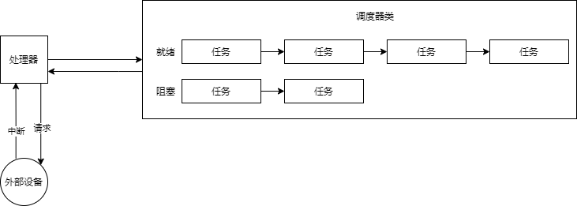
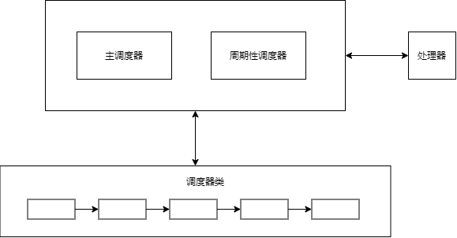

# 1.6 进程调度

不瞒您说，其实我并不特别关注进程的调度规则，因为于我们而言，进程总是乱序执行的，即便我们知道调度规则，也基本上不可能预测进程的调度顺序。

但或许有读者对操作系统的多进程实现原理不太熟悉，因此本节笔者会将侧重点放在进程的调度实现原理上，而降低本该成为重点的调度算法的比重。倘若您对进程调度不那么感兴趣，大可以跳过本节。

另外，我相信有很多读者是知道“时间片”这个概念的，但可惜的是，在后来的Linux版本中，对于“普通进程”，已经不使用这种调度方式了。内核改用了一种新的“完全公平调度机制”，使用红黑树来协调调度任务，对于这一类调度方案来说，不存在“时间片”的概念，有的只是"不公平"程度。调度器往往会选择遭受“不公平”最多的那个任务进行运行，而运行的时长取决于整个红黑树的分量以及各个任务的优先级，优先级大的一般会少运行一些，因为它们更容易被调度器选择，很容易导致其他任务遭受不公平的对待。

### 1.6.1 相关数据

```c
struct task_struct {
	int				prio;
	int				static_prio;
	int				normal_prio;
	unsigned int			rt_priority;
	
	struct sched_entity		se;
	struct sched_rt_entity		rt;
	struct sched_dl_entity		dl;
	const struct sched_class	*sched_class;
};
```

* prio：动态优先级。调度器最终会以该成员的数值为准。数值越低，优先级越高（0\~139）
* static\_prio：静态优先级。是进程在启动之初就被分配的优先级，一般不会改变，用以决定进程获取CPU的能力，一旦被修改了，就要重新计算prio和normal\_prio
* normal\_prio：普通优先级。值越小优先级越大。
* rt\_priority：实时优先级。区别于普通进程所使用的优先级，这类进程称之为”实时进程“，值越大优先级越高。

> 实时进程：区别于普通进程，它们总被认为是处于活动状态。任何时候，实时进程的优先级都要高于普通进程，但它们一般遵守”一次做完“或”多次轮转“。但这里所说的轮转发生在实时进程之间，实时进程会被置于一个队列，如果当前进程用光了自己的时间片却没能做完工作，就会被置于队列尾部，然后换上该队列的下一个实时进程，直到把实时进程全都结束掉。
>
> 不过，实时进程之间也存在优先级，只有同级别的进程才会需要轮流，如果此时插进来一个优先级更高的实时进程，那么其他所有进程都必须让着它。

* sched\_entity：这是一个调度类条目，它标志了嵌入它的结构为一个“调度实体”。调度器调度的基本单位是调度实体，它可以是任意一个任务，也可能会是线程组、进程组这类囊括众多的对象。
* se/rt/dl：这意味着有三种调度器能够对任务进行调度。
* sched\_class：调度器类。

> 调度器不一定只有一个，尤其是在现在多核心处理器中，处理器的每个核心都能够拥有一个专属的调度器，该项能够指定由哪一个调度器来对自身进行调度。

### 1.6.2 调度器类

定义如下：

```c
struct sched_class {

#ifdef CONFIG_UCLAMP_TASK
	int uclamp_enabled;
#endif

	void (*enqueue_task) (struct rq *rq, struct task_struct *p, int flags);
	void (*dequeue_task) (struct rq *rq, struct task_struct *p, int flags);
	void (*yield_task)   (struct rq *rq);
	bool (*yield_to_task)(struct rq *rq, struct task_struct *p);

	void (*check_preempt_curr)(struct rq *rq, struct task_struct *p, int flags);

	struct task_struct *(*pick_next_task)(struct rq *rq);

	void (*put_prev_task)(struct rq *rq, struct task_struct *p);
	void (*set_next_task)(struct rq *rq, struct task_struct *p, bool first);

#ifdef CONFIG_SMP
	int (*balance)(struct rq *rq, struct task_struct *prev, struct rq_flags *rf);
	int  (*select_task_rq)(struct task_struct *p, int task_cpu, int flags);

	struct task_struct * (*pick_task)(struct rq *rq);

	void (*migrate_task_rq)(struct task_struct *p, int new_cpu);

	void (*task_woken)(struct rq *this_rq, struct task_struct *task);

	void (*set_cpus_allowed)(struct task_struct *p,
				 const struct cpumask *newmask,
				 u32 flags);

	void (*rq_online)(struct rq *rq);
	void (*rq_offline)(struct rq *rq);

	struct rq *(*find_lock_rq)(struct task_struct *p, struct rq *rq);
#endif

	void (*task_tick)(struct rq *rq, struct task_struct *p, int queued);
	void (*task_fork)(struct task_struct *p);
	void (*task_dead)(struct task_struct *p);

	/*
	 * The switched_from() call is allowed to drop rq->lock, therefore we
	 * cannot assume the switched_from/switched_to pair is serialized by
	 * rq->lock. They are however serialized by p->pi_lock.
	 */
	void (*switched_from)(struct rq *this_rq, struct task_struct *task);
	void (*switched_to)  (struct rq *this_rq, struct task_struct *task);
	void (*prio_changed) (struct rq *this_rq, struct task_struct *task,
			      int oldprio);

	unsigned int (*get_rr_interval)(struct rq *rq,
					struct task_struct *task);

	void (*update_curr)(struct rq *rq);

#define TASK_SET_GROUP		0
#define TASK_MOVE_GROUP		1

#ifdef CONFIG_FAIR_GROUP_SCHED
	void (*task_change_group)(struct task_struct *p, int type);
#endif
};
```

“类”其实已经有了面向对象的意思了，上述定义的实例化正是如此。 笔者在这里不愿意过多谈论它的意义，请直接往下看吧。

### 1.6.3 调度类

还在使用“时间片”进行调度的时代，内核通过维护队列进行调度。

* 任务们会被排在**就绪队列**中等待调度，它们的task\_struct将告诉它们拥有的时间片
* 处理器每次取出队列的第一个任务进行执行，一旦时间片耗尽，就将他放到队尾
* 如果一个任务在执行过程中需要等待（比方说等待硬盘准备数据），就会被处理器加入**阻塞队列**，当硬盘完成数据准备之后，将阻塞队列中的任务重新加进**就绪队列**的队尾，直到下一次被调度



这是一种非常效率的方案，但对用户来说不见得那么友好。那些我们迫切需要得到反馈的任务也需要等待足够多的时间才能发出响应，这会让我们的体验不那么顺畅，毕竟如果我们的输入要等待一会才能出现在屏幕上，就会显得计算机的效率很慢，但我们往往愿意让那些能够在后台运行的进程再等一会也要先让记事本把数据显示出来。

现在，内核用更复杂的调度规则来回应了我们的需求。它用红黑树来实现一种完全公平的调度策略，但同时它支持“任务抢占”和“内核抢占”。其大致架构如下：



* 周期性调度器：周期性执行，由时钟中断触发。它会去检查进程执行的时间是否超过了ideal\_runtime，若超出则通知主调度器进一步协调。另外，它还会尝试触发处理器负载均衡
* 主调度器：切换上下文的主要负责函数。它需要从调度器类中得到下一个合适的任务，然后让处理器切换上下文
* 调度器类：调度器类会负责选出一个合适的任务递给主调度器。

> 但需要注意的是，内核维护了多个调度器类以提供不同的的调度策略。除了完全公平调度外，它们也支持其他方案，不同的方案有不同的调度器类，内核一共有5种调度器类。
>
> * stop\_sched\_class：CPU停止任务
> * dl\_sched\_class：最终期限调度类，必须在一定时间内完成的调度类(dl-deadline)
> * rt\_sched\_class：运行时调度类，主要负责调度实时进程
> * fair\_sched\_class：完全公平调度类，大多数普通进程都在这类被调度
> * idle\_sched\_class：IDLE调度类，其负责调度那些在CPU实在没事可做的时候才会选择的任务
>
> 它们的优先级自上而下依次降低。

当主调度器获取到了下一个应该切换的任务以后，便会调用 **context\_switch** 进行上下文切换。

```
┌──────────────┐
│context_switch│
└───────┬──────┘
       │          ┌────────────────┐
       │          │switch_mm       │
       ├──────────►                │
       │          └────────────────┘
       │
       │
       │          ┌────────────────┐
       │          │switch_to       │
       └──────────►                │
                  └────────────────┘
```

switch\_mm：切换虚拟地址和物理地址的映射关系（本质就是切换页表） switch\_to：切换寄存器状态

> 切换寄存器状态不只意味着普通的寄存器数值，它还包括对栈的切换。 因此swtich\_to执行过程中，当寄存器状态完全恢复成另外一个进程的时候，也意味着EIP已经切换完毕，这个时候就已经开始执行新进程了。 当这个新进程也需要切换上下文的时候也有相同的情况。 如果接下来我们需要切换回原来的进程，那么就会恢复到switch\_to的下半部分。 此时已经是原本的进程，它会继续执行switch\_to，然后恢复到自己本来的代码段。

### 1.6.4 主调度器流程

调度发生的时机：

* 进程陷入等待，这个时候应该主动进行调度以防止它浪费时间
* 进程运行到极限了，操作系统不可能运行进程永远运行下去，否则其他进程就一直在排队了，因此操作系统会在适时的时候将进程换下
* 进程主动放弃处理器，此时操作系统会另外选择一个进程来替换（比方说，进程已经做完大部分工作了，剩下的工作可以留到处理器无事可做的时候慢慢处理）

切换进程的主要工作是由主调度器完成的。

schedule主调度器首先需要设定一些标志表示当前需要进行上下文切换，并且禁止抢占，但关键内容由\_\_schedule函数实现。

```
┌───────────────┐
│__schedule     │
│               │
└───────┬───────┘
        │
        │
        │      ┌─────────────────────┐
        │      │ init_and_check      │
        ├─────►│                     │
        │      └─────────────────────┘
        │
        │      ┌─────────────────────┐
        ├─────►│ deactivate_task     │
        │      │                     │
        │      └─────────────────────┘
        │
        │      ┌─────────────────────┐
        │      │ pick_next_task      │
        ├─────►│                     │
        │      └─────────────────────┘
        │
        │      ┌─────────────────────┐
        │      │ context_switch      │
        └─────►│                     │
               └─────────────────────┘
```

* 首先初始化并检查一些必要的数据，然后把当前任务移出队列
* 接下来通过主调度器的pick\_next\_task选择下一个合适的任务
* context\_switch切换到新任务

> 主调度器的pick\_next\_task会根据调度器类的优先级分别调用不同调度器类中的同名函数pick\_next\_task，该函数会根据自己的选择逻辑返回一个合适的任务

### 1.6.5 任务抢占

> 本节属于番外，我们可以独立的去理解它。

每个任务存在一个特殊标志位 **TIF\_NEED\_RESCHED** 以表示该任务是否应该去抢占其他任务。 设置主要发生在几个特殊情况下：

* 周期调度器发现任务的**时间片**耗尽时（你会发现，使用时间片意味着它不会遵守完全公平规则）
* 唤醒进程时，一般会将被唤醒的任务加入到队列等待调度。但如果被唤醒的任务有着高于目前任务的优先级，就会让新任务直接抢占当前任务
* 新进程创建时，对于优先级更高的任务，sched\_fork会设置该标记（类似exec的情况）
* 修改nice值时，会重新计算任务优先级，如果它的优先级高于当前进程，就会发生抢占
* 负载均衡时，将当前处理器的某个任务推个其他处理器时，会将这个任务标记为抢占，让其他处理器优先接管任务

> 之前笔者一直没有提到nice值，但您可以当它是static\_prio。笔者之前说它一般不会被改变，但用户是可以通过设置nice值的系统调用强行改变它，一旦改变了它，就会需要重新计算其他优先级。

然后在某些特别的时机，内核便会检测是否有任务标志了TIF\_NEED\_RESCHED，如果它发现了，就将该标志取消后切换过去：

* 用户态抢占:从系统调用或者中断中返回用户态时，会尝试检测TIF\_NEED\_RESCHED
* 内核抢占：中断返回内核时，或者内核又“禁止抢占”变成“运行抢占”时，会检查TIF\_NEED\_RESCHED判断是否应该抢占

### 1.6.6 参考资料

* 一文搞懂Linux进程调度原理 https://zhuanlan.zhihu.com/p/348813914
* Linux调度器：进程优先级 http://www.wowotech.net/process\_management/process-priority.html
* Linux调度器：进程优先级 https://blog.csdn.net/wukongmingjing/article/details/83106431
* linux调度器源码分析 - 概述(一) https://www.cnblogs.com/tolimit/p/4303052.html
* Linux内核学习笔记（5）-- 进程调度概述 https://www.cnblogs.com/tongye/p/9575602.html
* 抢占(PREEMPTION)是如何发生的 http://linuxperf.com/?p=211
